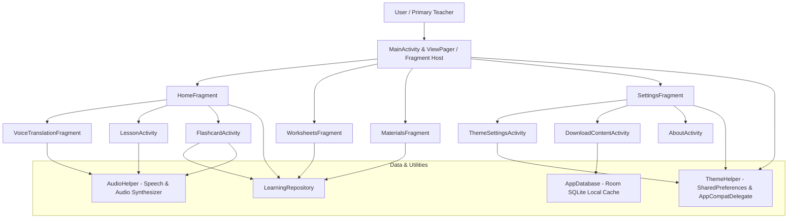

# वाणी-SHIKSHA (Vaani-Shiksha)
### *Cultural Connectivity Platform*

[](https://developer.android.com)
[](https://developer.android.com)
[](https://developer.android.com)
[](LICENSE)
[](https://www.sih.gov.in/)

> **SIH26042**: *AI-Powered Vernacular Pedagogy & Real-Time Translation Tool for Mother Tongue-Based Primary Education*  
> **Target Region**: Primary Schools across Jharkhand (Tribal & Regional Languages)

---

## 📌 Executive Summary

In remote primary schools across Jharkhand and eastern India, young tribal children enter Class 1 speaking exclusively their mother tongue (**Santhali**, **Mundari**, or **Ho**), while primary school teachers predominantly communicate and teach using standard state curricula in **Hindi** or **English**. This linguistic divide leads to high dropout rates, classroom anxiety, and severe foundational literacy & numeracy (FLN) deficits.

**वाणी-SHIKSHA** is an offline-first mobile learning and pedagogy platform designed to bridge this gap. It provides bilingual classroom teaching toolkits, real-time voice translation, interactive flashcards, regional curriculum worksheets, and audio pronunciation guides, allowing teachers to impart lessons seamlessly in the child's mother tongue while fostering gradual transition into state curricula.

---

## 🌟 Key Features

### 1. 🎙️ Live Classroom Voice Translation
- **Real-Time Speech-to-Vernacular Translation**: Teachers speak in Hindi, and the platform transcribes and translates the lesson concepts into tribal languages (**Santhali ᱥᱟᱱᱛᱟᱲᱤ**, **Mundari मुंडारी**, **Ho ᱦᱳ**).
- **Audio Pronunciation Synthesis**: Real-time audio playback allows students to listen to phrases and vocabulary in their natural vernacular dialect.
- **Instant Language Pair Switching**: Seamlessly toggle between Hindi ➔ Santhali, Hindi ➔ Mundari, and Hindi ➔ Ho with a single tap.

### 2. 📚 Curriculum & Multi-Script Pedagogy
- **Class 1 & 2 Foundational Modules**: Tailored lessons for Mathematics (Numbers 1–10 counting, basic addition) and Environmental Studies (EVS).
- **Dual-Script Presentation**: Displays both Devanagari transliteration and native Ol Chiki script alongside English and Hindi so teachers and children can read along effortlessly.
- **Step-by-Step Interactive Guides**: Structured slides and audio-prompted counting exercises.

### 3. 🃏 Interactive Flashcards & Vocabulary Builder
- **Visual Association**: High-contrast, child-friendly illustrations paired with everyday nouns (fruits, animals, numbers, family members).
- **Tap-to-Reveal Translation**: Teachers or students can tap cards to reveal hidden vernacular translations and transliterations (e.g., *सेब ➔ Seb ➔ Apple ➔ ᱟᱯᱮᱞ / ᱥᱟᱠᱟᱢ*).
- **Native Audio Playback**: Instant auditory reinforcement for correct pronunciation.

### 4. 📝 Worksheets & Printable Teaching Materials
- **Classroom Exercises**: Downloadable mathematics worksheets, counting grids, and language practice sheets.
- **Multi-Category Filters**: Categorized by Mathematics, Languages, and EVS/Science.
- **Offline Download Manager**: Teachers can pre-download lesson packages, translation models, and worksheet PDFs for offline field use.

### 5. ⚡ 100% Offline-First Architecture
- Built with local SQLite/Room database storage.
- Operates completely without mobile network or internet connectivity once content packages are downloaded—vital for remote forest and hilly areas in Jharkhand.

### 6. 🌓 Single-Touch Theme Adaptation (Dark & Light Mode)
- **Instant ON/OFF Switch**: Single toggle switch in Theme Settings and Main Settings to switch instantly between Light and Dark visual modes.
- **Daytime Classroom Light Mode**: High-contrast, eye-friendly soft mint with classroom forest green (`#167653`).
- **Low-Light Dark Mode**: Glare-free deep navy slate (`#071C2C`) with vibrant high-contrast teal (`#18C58B`).

---

## 🎨 Cultural Identity & Brand Motif

The emblem of **वाणी-SHIKSHA** is crafted to symbolize the synthesis of tribal heritage and modern educational technology:
- **Shield of Protection & Empowerment**: Signifies cultural preservation and educational defense.
- **Connecting Hands with Traditional Spirals**: Depicts teacher-student communication, collaboration, and tribal art traditions (inspired by Sohrai and Kohbar indigenous art).
- **Circuit Pathways & Nodes**: Symbolizes intelligent digital bridges that connect ancestral languages with digital-age education.

---

## 📱 Application Screens

| Screen | Description |
| :--- | :--- |
| **Landing Page (Splash)** | Official shield emblem, dual-toned **वाणी-SHIKSHA** typography, and government initiative credentials. |
| **Home Hub** | Active language pair banner, quick-change language modal, and quick-access teaching toolkits (Live Translation, Curriculum, Worksheets, Flashcards). |
| **Live Translation** | Waveform microphone input, real-time transcription in Hindi, translated target text with audio pronunciation. |
| **Curriculum Lessons** | Step-by-step Class 1 interactive mathematics lessons with native counting pronunciations and visual counters. |
| **Flashcard Deck** | Interactive flip cards with tap-to-reveal translations and voice pronunciation. |
| **Materials & Worksheets**| Searchable catalog of worksheets and educational media with category filters (Math, Language, EVS). |
| **Content Downloader** | Offline package manager showing local storage, package sizes, and download/remove controls. |
| **Theme & Settings** | Streamlined Dark Mode ON/OFF toggle, language selectors, offline indicators, and project documentation. |

---

## 🛠️ Architecture & Tech Stack



- **Operating System / Target**: Android 9.0+ (API Level 28 to 34)
- **Programming Language**: Java (JDK 8 / 17 compatible)
- **UI Framework**: AndroidX, Material Design Components (`com.google.android.material:material:1.11.0`), ConstraintLayout
- **Local Persistence**: Room SQLite Database (`androidx.room:room-runtime:2.6.1`)
- **Theme Engine**: Material DayNight with dynamic attribute palette switching
- **Audio & Media**: Android MediaPlayer, TextToSpeech, and AudioRecorder

---

## 🚀 Getting Started & Build Instructions

### Prerequisites
- Android Studio Iguana / Jellyfish or higher (or Gradle 8.9+ CLI)
- Android SDK with Platform 34 installed
- JDK 17 or higher
- Android device or emulator running Android 9.0 (API 28) or above

### 1. Clone the Repository
```bash
git clone https://github.com/AdityaBangar27/SIH-2026.git
cd SIH-2026
```

### 2. Build the Debug APK
```bash
# On Windows (PowerShell / CMD):
.\gradlew assembleDebug

# On Linux / macOS:
./gradlew assembleDebug
```

The compiled APK will be generated at:
```
app/build/outputs/apk/debug/app-debug.apk
```

### 3. Install on Connected Device / Emulator
```bash
adb install app/build/outputs/apk/debug/app-debug.apk
```
Or open the project in **Android Studio** and click **Run 'app'** (`Shift + F10`).

---

## 📂 Project Structure

```
SIH-2026/
├── app/
│   ├── build.gradle                             # App-level dependencies & SDK configs
│   └── src/main/
│       ├── AndroidManifest.xml                  # Manifest, permissions & launcher configs
│       ├── java/com/vernacular/learning/
│       │   ├── VernacularApp.java               # Application class (Theme init)
│       │   ├── MainActivity.java                # Main navigation hub (Bottom nav)
│       │   ├── SplashActivity.java              # Landing page with branded logo
│       │   ├── data/
│       │   │   ├── local/                       # Room database & entities
│       │   │   ├── models/                      # Flashcard, worksheet & material models
│       │   │   └── repository/                  # LearningRepository for mock/cached data
│       │   ├── ui/
│       │   │   ├── home/                        # HomeFragment & toolkit shortcuts
│       │   │   ├── translation/                 # VoiceTranslationFragment (Live mic)
│       │   │   ├── lesson/                      # LessonActivity (Interactive math lessons)
│       │   │   ├── flashcards/                  # FlashcardActivity (Tap-to-reveal deck)
│       │   │   ├── worksheets/                  # WorksheetsFragment & Adapter
│       │   │   ├── materials/                   # MaterialsFragment & search filters
│       │   │   ├── settings/                    # SettingsFragment & ThemeSettingsActivity
│       │   │   ├── downloads/                   # DownloadContentActivity & packages
│       │   │   └── about/                       # AboutActivity (Project background)
│       │   └── utils/
│       │       ├── ThemeHelper.java             # Day/Night mode preference manager
│       │       ├── PreferenceHelper.java        # Language and class preferences
│       │       └── AudioHelper.java             # Pronunciation & audio playback
│       └── res/
│           ├── color/                           # State-list selectors (Bottom navigation)
│           ├── drawable/                        # Official vector icons & emblem logo
│           ├── layout/                          # UI XML layouts
│           ├── values/                          # Strings, light theme styles, colors, attrs
│           └── values-night/                    # Dark theme styles & overrides
├── gradle/                                      # Gradle wrapper files
├── build.gradle                                 # Project-level build script
├── settings.gradle                              # Module inclusion settings
└── README.md                                    # Project documentation
```

---

## 🇮🇳 Impact & NEP 2020 Alignment

- **National Education Policy (NEP 2020, Clause 4.11–4.13)**: Mandates that wherever possible, the medium of instruction until at least Grade 5 shall be the mother tongue / regional language.
- **NIPUN Bharat Mission**: Ensures every child achieves foundational literacy and numeracy by the end of Grade 3.
- **Empowering Primary Teachers**: Eliminates the fear of teaching in unfamiliar tribal dialects by providing instant, phonetically accurate pedagogical aids.
- **Preserving Tribal Linguistic Heritage**: Preserves languages like Santhali, Mundari, and Ho through digital learning resources, scripts, and audio recordings.

---

## 👥 Contributors & Acknowledgements

- **Developed for**: Smart India Hackathon (SIH) 2026
- **Problem Statement**: SIH26042
- **Lead Developer & Maintainer**: [Aditya Bangar](https://github.com/AdityaBangar27)

---

## 📄 License

This project is licensed under the MIT License — see the [LICENSE](LICENSE) file for details.
