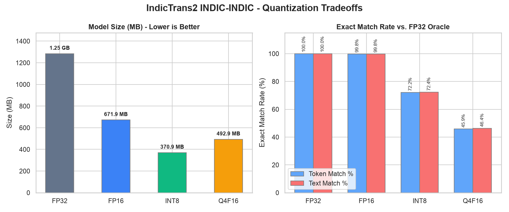
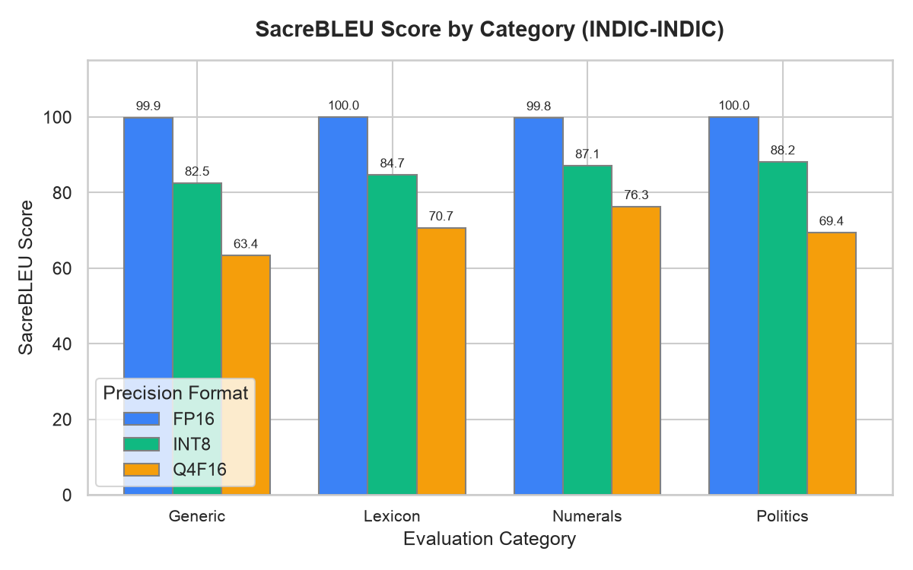

# IndicTrans2 200M (indic→indic) — ONNX bundle [INT8 (Dynamic Quantization)]

> [!TIP]
> This model is part of a suite of optimized/quantized ONNX versions of the base model.
> Other variants in this direction:
> - **FP32 (Full Precision / Base)**: [`hari31416/indictrans2-indic-indic-dist-320M-ONNX`](https://huggingface.co/hari31416/indictrans2-indic-indic-dist-320M-ONNX)
> - **FP16 (Half Precision)**: [`hari31416/indictrans2-indic-indic-dist-320M-ONNX-fp16`](https://huggingface.co/hari31416/indictrans2-indic-indic-dist-320M-ONNX-fp16)
> - **INT8 (Dynamic Quantization)**: [`hari31416/indictrans2-indic-indic-dist-320M-ONNX-int8`](https://huggingface.co/hari31416/indictrans2-indic-indic-dist-320M-ONNX-int8) *(Current)*
> - **Q4F16 (4-bit Block Quantization)**: [`hari31416/indictrans2-indic-indic-dist-320M-ONNX-q4f16`](https://huggingface.co/hari31416/indictrans2-indic-indic-dist-320M-ONNX-q4f16)

ONNX-exported and quantized version of [`ai4bharat/indictrans2-indic-indic-dist-320M`](https://huggingface.co/ai4bharat/indictrans2-indic-indic-dist-320M)
for in-browser and local edge inference.

- **Precision**: INT8 (Dynamic Quantization)
- **Description**: Dynamic INT8 quantization of the encoder and decoder. Highly recommended for CPU environments.
- **Source Pipeline & Details**: For pipeline details, benchmarks, and usage instructions, see the [indictrans2-onnx-export GitHub repository](https://github.com/Hari31416/indictrans2-onnx-export).

Built for use with [Transformers.js](https://github.com/huggingface/transformers.js)
and [onnxruntime-web](https://onnxruntime.ai/docs/get-started/with-javascript.html)
in the browser, with fast BPE tokenizer.json files that don't require the
SentencePiece WASM runtime.

## Performance Visualizations

These charts show overall tradeoffs, language-level parity, and category breakdown.





## Performance Tradeoffs & Size Comparison

Compared against the FP32 ONNX oracle on the golden evaluation fixtures.

| Format | Model Size | Exact Match (Token) | Exact Match (Text) | SacreBLEU (Raw) | Latency (Mean) | Speedup vs. FP32 |
| :--- | :--- | :--- | :--- | :--- | :--- | :--- |
| FP32 | 1.87 GB | 100.00% | 100.00% | 100.00 | 23.0 ms | 1.000x |
| FP16 | 980.2 MB | 99.82% | 99.82% | 100.00 | 27.4 ms | 0.840x |
| INT8 | 497.1 MB | 72.18% | 72.36% | 87.13 | 16.5 ms | 1.475x |
| Q4F16 | 711.6 MB | 45.91% | 46.36% | 71.64 | 28.3 ms | 0.829x |

## Language-Level Parity (INT8)

Exact match rates and translation quality (SacreBLEU / chrF) per language pair under this precision:

| Language Code | Total Fixtures | Token Match Rate | Text Match Rate | SacreBLEU | SacreBLEU (chrF) |
| :--- | :--- | :--- | :--- | :--- | :--- |
| **asm_Beng** | 50 | 76.0% | 76.0% | 87.32 | 95.24 |
| **ben_Beng** | 50 | 68.0% | 68.0% | 88.34 | 95.76 |
| **brx_Deva** | 50 | 66.0% | 66.0% | 82.54 | 93.75 |
| **doi_Deva** | 50 | 76.0% | 76.0% | 90.11 | 94.95 |
| **gom_Deva** | 50 | 76.0% | 76.0% | 86.95 | 93.38 |
| **guj_Gujr** | 50 | 88.0% | 88.0% | 96.16 | 98.54 |
| **hin_Deva** | 50 | 80.0% | 80.0% | 91.64 | 96.19 |
| **kan_Knda** | 50 | 84.0% | 84.0% | 90.20 | 96.61 |
| **kas_Arab** | 50 | 70.0% | 70.0% | 85.53 | 92.09 |
| **mai_Deva** | 50 | 82.0% | 84.0% | 92.47 | 95.03 |
| **mal_Mlym** | 50 | 78.0% | 78.0% | 88.36 | 94.82 |
| **mar_Deva** | 50 | 82.0% | 82.0% | 91.51 | 95.37 |
| **mni_Beng** | 50 | 68.0% | 68.0% | 86.41 | 93.50 |
| **npi_Deva** | 50 | 58.0% | 60.0% | 73.60 | 88.80 |
| **ory_Orya** | 50 | 68.0% | 68.0% | 85.31 | 95.18 |
| **pan_Guru** | 50 | 86.0% | 86.0% | 94.72 | 96.92 |
| **san_Deva** | 50 | 70.0% | 70.0% | 79.70 | 91.60 |
| **sat_Olck** | 50 | 60.0% | 60.0% | 86.30 | 92.15 |
| **snd_Arab** | 50 | 32.0% | 32.0% | 42.11 | 49.16 |
| **tam_Taml** | 50 | 66.0% | 66.0% | 82.31 | 93.73 |
| **tel_Telu** | 50 | 76.0% | 76.0% | 86.94 | 94.19 |
| **urd_Arab** | 50 | 78.0% | 78.0% | 92.24 | 96.00 |

## Category-Level Parity (INT8)

Exact match rates and translation quality grouped by category types:

| Category | Total Fixtures | Token Match Rate | Text Match Rate | SacreBLEU | SacreBLEU (chrF) |
| :--- | :--- | :--- | :--- | :--- | :--- |
| **Generic** | 286 | 67.8% | 68.2% | 82.54 | 91.29 |
| **Lexicon** | 264 | 68.9% | 68.9% | 84.70 | 90.98 |
| **Numerals** | 264 | 73.5% | 73.5% | 87.13 | 93.50 |
| **Politics** | 286 | 78.3% | 78.7% | 88.15 | 93.69 |

## Translation Mismatch Examples

Here is a sample of up to 5 translation mismatches compared to the FP32 oracle. Many mismatches represent minor synonym differences or spacing variations.

### Mismatch #1 (Category: Numerals)
- **Source (asm_Beng → ben_Beng)**: `আপুনি অনুগ্ৰহ কৰি মোক নিকটতম চিকিৎসালয়খন বিচাৰি উলিওৱাত সহায় কৰিব পাৰিবনে?`
- **Expected (FP32)**: `আপনি কি দয়া করে নিকটতম হাসপাতাল খুঁজে পেতে আমার সাহায্য করতে পারেন?`
- **Actual (INT8)**: `আপনি কি দয়া করে নিকটতম হাসপাতাল খুঁজে পেতে আমাকে সাহায্য করতে পারেন?`

### Mismatch #2 (Category: Lexicon)
- **Source (asm_Beng → ben_Beng)**: `মই দিল্লীলৈ বিমানৰ টিকট এখন বুক কৰিব বিচাৰো।`
- **Expected (FP32)**: `আমি দিল্লিতে যাওয়ার জন্য একটি বিমানের টিকিট বুক করতে চাই।`
- **Actual (INT8)**: `আমি দিল্লিতে একটি বিমানের টিকিট বুক করতে চাই।`

### Mismatch #3 (Category: Numerals)
- **Source (asm_Beng → ben_Beng)**: `মোৰ ফোন নম্বৰটো হৈছে + 91-9876543210।`
- **Expected (FP32)**: `আমার ফোন নম্বর হল + 91-9876543210।`
- **Actual (INT8)**: `আমার ফোন নম্বর + 91-9876543210।`

### Mismatch #4 (Category: Generic)
- **Source (asm_Beng → ben_Beng)**: `কৃত্ৰিম বুদ্ধিমত্তাই শিক্ষাৰ ক্ষেত্ৰত পৰিৱৰ্তন কঢ়িয়াই আহিছে।`
- **Expected (FP32)**: `কৃত্রিম বুদ্ধিমত্তা শিক্ষার ক্ষেত্রে পরিবর্তন আনছে।`
- **Actual (INT8)**: `কৃত্রিম বুদ্ধিমত্তা শিক্ষার ক্ষেত্রে পরিবর্তন নিয়ে এসেছে।`

### Mismatch #5 (Category: Numerals)
- **Source (asm_Beng → ben_Beng)**: `ৱেবছাইটটোৰ ব্যৱহাৰকাৰী আন্তঃপৃষ্ঠ পৰিষ্কাৰ আৰু আধুনিক।`
- **Expected (FP32)**: `ওয়েবসাইটের ব্যবহারকারী ইন্টারফেস পরিষ্কার এবং আধুনিক।`
- **Actual (INT8)**: `ওয়েবসাইটের ব্যবহারকারী ইন্টারফেসটি পরিষ্কার এবং আধুনিক।`


## Files

- `encoder_model.onnx` (and optional `.onnx.data` weights sidecar)
- `decoder_model.onnx` and `decoder_with_past_model.onnx` (share `decoder_shared.onnx.data` when present)
- `translate.py` — self-contained Python inference helper (see Usage below)
- Fast tokenizer config files (`tokenizer_src.json`, `tokenizer_tgt.json`, `tokenizer_meta.json`)
- Model configuration configs (`config.json`, `generation_config.json`)

## Usage Example (Python, onnxruntime)

```python
# translate.py is included in this repo alongside the ONNX bundle.
# You can also find it (and read the full source) at:
#   https://github.com/Hari31416/indictrans2-onnx-export/blob/main/src/translate.py

from translate import IndicTransONNX

# Pass a HF repo ID for automatic download, or a local bundle directory path
model = IndicTransONNX("hari31416/indictrans2-indic-indic-dist-320M-ONNX-int8")
print(model.translate("चुनाव कौन जीतेगा?", src_lang="hin_Deva", tgt_lang="tam_Taml"))
```

Required packages:

```bash
pip install onnxruntime tokenizers huggingface-hub
```

## License

MIT (preserved from upstream AI4Bharat).
